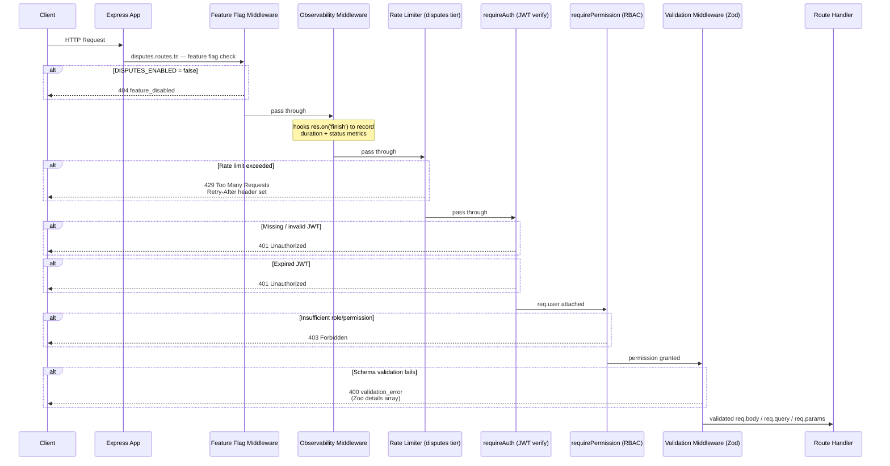
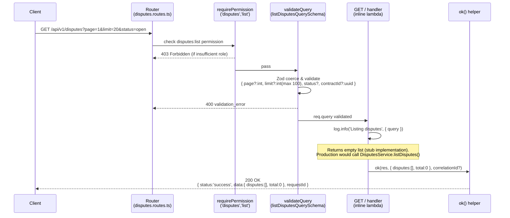
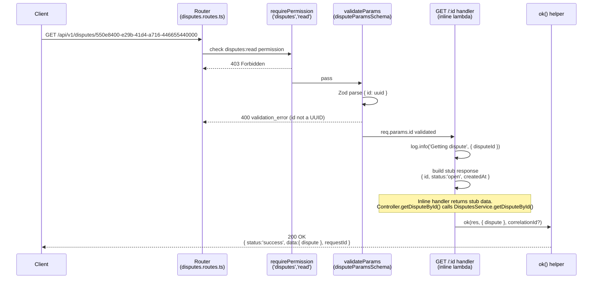
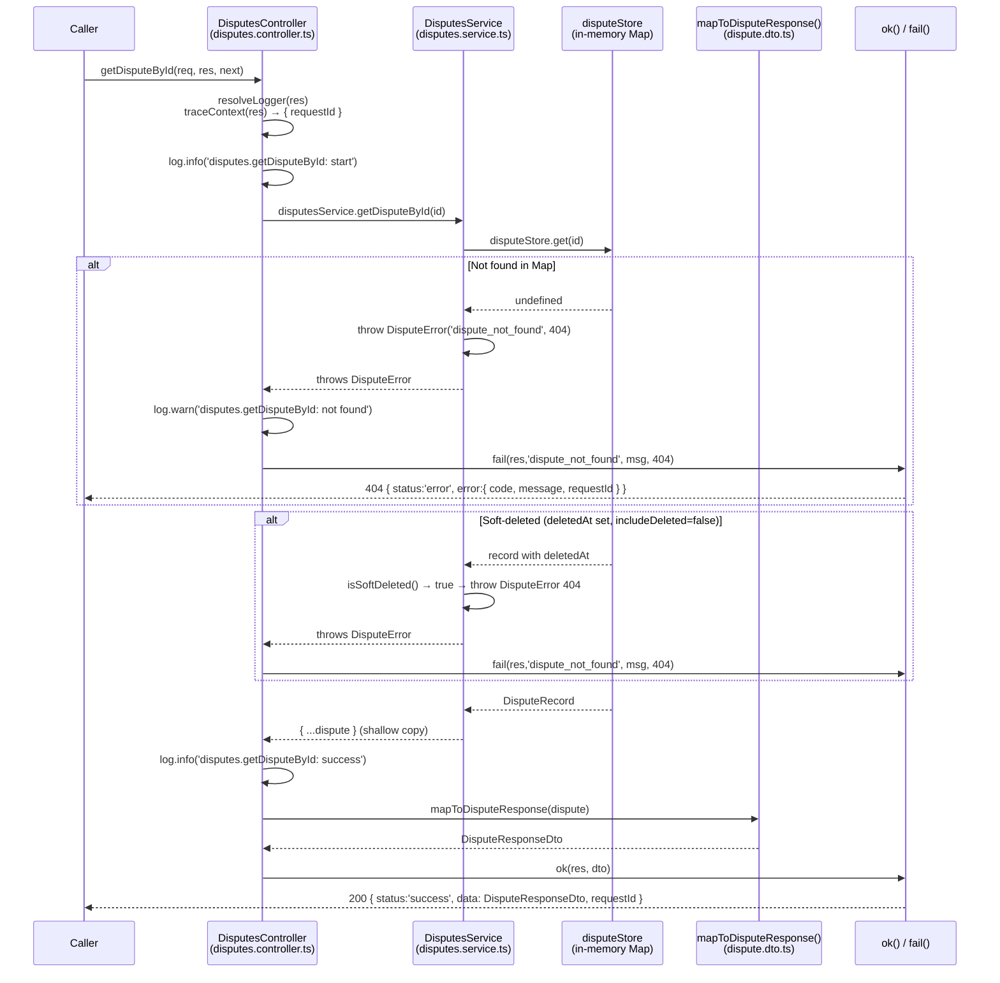
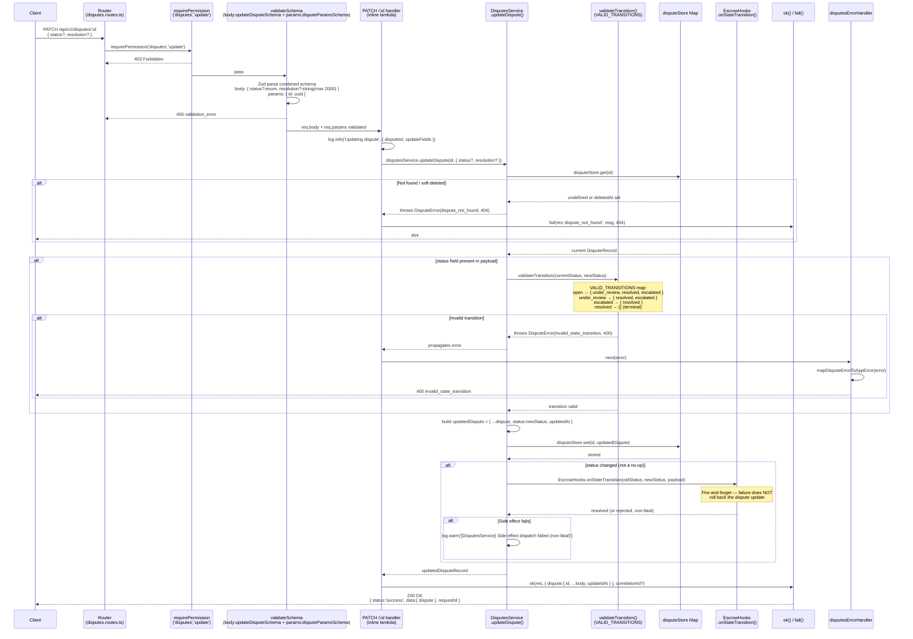
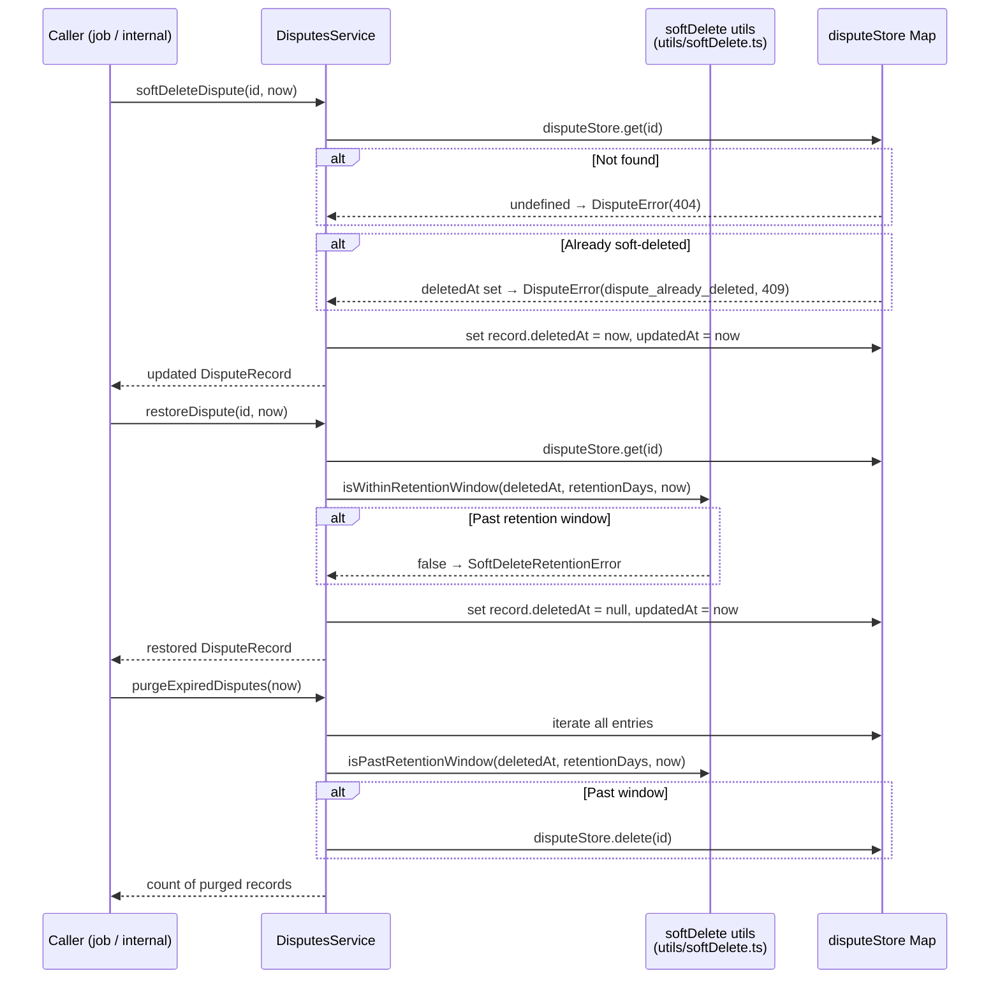
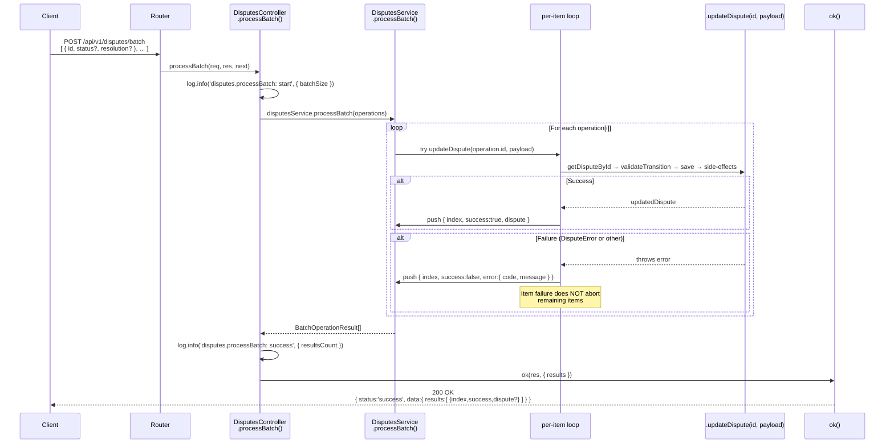
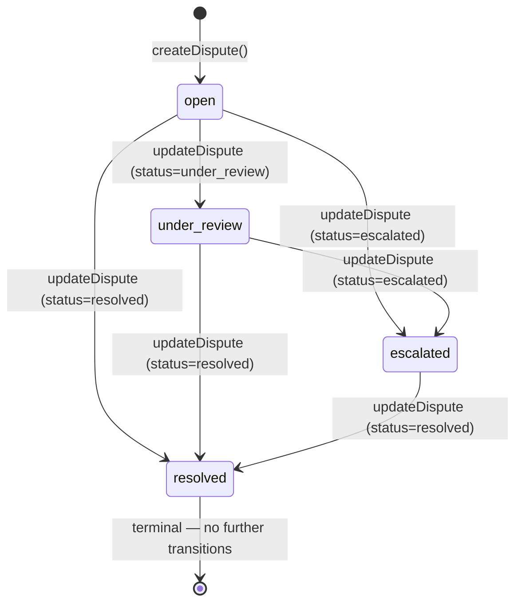
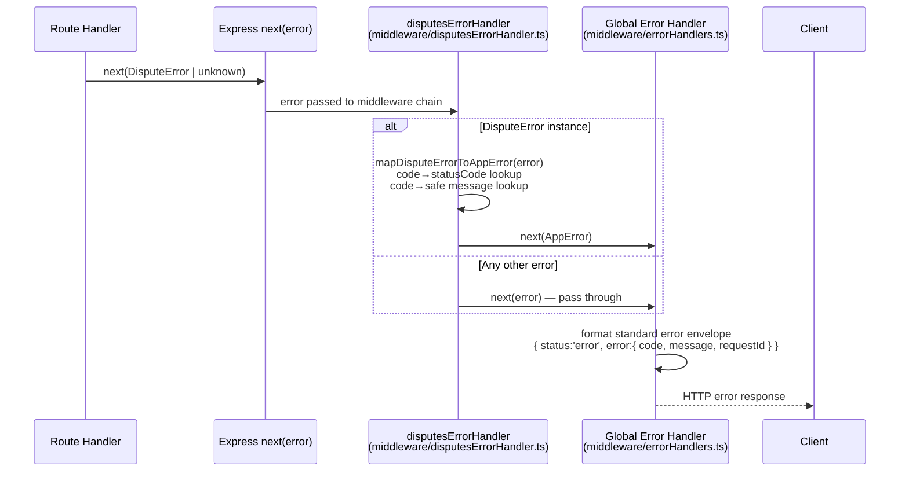

# Disputes Request Lifecycle

> **Issue #1048** — Sequence diagrams for the disputes request lifecycle:
> middleware → handler → service → in-memory store.

This document provides per-operation sequence diagrams showing how each HTTP
request travels through the full disputes stack, from the HTTP client all the
way down to the in-memory store and back.

## Table of Contents

- [Stack Overview](#stack-overview)
- [Common Middleware Chain](#common-middleware-chain)
- [Operations](#operations)
  - [POST /disputes — Create Dispute](#post-disputes--create-dispute)
  - [GET /disputes — List Disputes](#get-disputes--list-disputes)
  - [GET /disputes/:id — Get Dispute](#get-disputesid--get-dispute)
  - [PATCH /disputes/:id — Update Dispute](#patch-disputesid--update-dispute)
  - [DELETE /disputes/:id — Delete Dispute](#delete-disputesid--delete-dispute)
- [Batch Operation](#batch-operation)
- [State Machine](#state-machine)
- [Error Flow](#error-flow)
- [Key Source Files](#key-source-files)

---

## Stack Overview

Every disputes request passes through the following layers in order:

| Layer | File(s) | Responsibility |
|-------|---------|----------------|
| Express Router | `src/routes/disputes.routes.ts` | Feature flag, observability, rate limiting, route dispatch |
| Auth Middleware | `src/middleware/authorization.ts` | JWT verification (`requireAuth`), RBAC (`requirePermission`) |
| Validation Middleware | `src/middleware/validate.middleware.ts` | Zod schema enforcement on body / query / params |
| Route Handler (inline) | `src/routes/disputes.routes.ts` | Orchestration, logging, calls `ok()` / `fail()` |
| DisputesController | `src/controllers/disputes.controller.ts` | Used by batch endpoint; individual CRUD routes use inline handlers |
| DisputesService | `src/services/disputes.service.ts` | Business logic, state-machine validation, side effects |
| In-memory Store | `src/services/disputes.service.ts` (`disputeStore Map`) | Persistence (demo — production would use a real DB) |
| Response Helpers | `src/utils/apiResponse.ts` | `ok()` / `fail()` — standard JSON envelope |
| Error Handler | `src/middleware/disputesErrorHandler.ts` | Maps `DisputeError` → `AppError` for global handler |

---

## Common Middleware Chain

Every request to `/api/v1/disputes*` passes through this shared stack before
reaching the route-specific handler:



---

## Operations

### POST /disputes — Create Dispute

**Permission required**: `disputes:create` (roles: `admin`, `client`, `freelancer`)

```mermaid
sequenceDiagram
    participant Client
    participant Router as Router<br/>(disputes.routes.ts)
    participant AuthZ as requirePermission<br/>('disputes','create')
    participant Validator as validateRequest<br/>(createDisputeSchema)
    participant Handler as POST / handler<br/>(inline lambda)
    participant ApiResponse as ok() helper<br/>(apiResponse.ts)

    Client->>Router: POST /api/v1/disputes<br/>Authorization: Bearer &lt;token&gt;<br/>{ contractId, reason, raisedBy }

    Note over Router: Feature flag + observability +<br/>rate limiter already applied (see common chain)

    Router->>AuthZ: requirePermission('disputes','create')
    AuthZ-->>Router: 403 Forbidden (if insufficient role)
    AuthZ->>Validator: pass (role ok)

    Validator->>Validator: Zod parse { contractId:uuid, reason:string, raisedBy?:uuid }
    Validator-->>Router: 400 validation_error (if invalid)
    Validator->>Handler: req.body sanitised & validated

    Handler->>Handler: log.info('Creating dispute', { disputeId })
    Handler->>Handler: generate disputeId = "dispute-" + Date.now()
    Handler->>Handler: build dispute object<br/>{ id, contractId, status:'open', createdAt }

    Note over Handler: Routes inline handler builds the dispute directly<br/>(does NOT call DisputesService.createDispute here)

    Handler->>ApiResponse: ok(res, { dispute }, correlationId?, 201)
    ApiResponse-->>Client: 201 Created<br/>{ status:'success', data:{ dispute }, requestId, correlationId? }
```

> **Note**: The inline POST handler on the route builds the object itself without
> calling `DisputesService.createDispute()`. The controller's `createDispute`
> method (also in-memory, no service call for create) exists for direct
> programmatic use but is not wired to the route.

---

### GET /disputes — List Disputes

**Permission required**: `disputes:list` (roles: `admin`, `auditor`, `client` ownOnly, `freelancer` ownOnly)



---

### GET /disputes/:id — Get Dispute

**Permission required**: `disputes:read` (roles: `admin`, `auditor`, `client` ownOnly, `freelancer` ownOnly)



#### GET /:id via DisputesController (programmatic path)

When `DisputesController.getDisputeById` is called (e.g. in integration tests
or future rewiring), the call continues into the service and store:



---

### PATCH /disputes/:id — Update Dispute

**Permission required**: `disputes:update` (roles: `admin`, `client` ownOnly)

This is the most involved path because it triggers state-machine validation and
cascading side effects (escrow hooks, notifications).



---

### DELETE /disputes/:id — Delete Dispute

**Permission required**: `disputes:delete` (role: `admin` only)

The route-level DELETE is a stub (returns success without hitting the service).
`DisputesService.softDeleteDispute()` is available but not wired to this route.

```mermaid
sequenceDiagram
    participant Client
    participant Router as Router<br/>(disputes.routes.ts)
    participant AuthZ as requirePermission<br/>('disputes','delete')
    participant Handler as DELETE /:id handler<br/>(inline lambda)
    participant ApiResponse as ok() helper

    Client->>Router: DELETE /api/v1/disputes/:id<br/>Authorization: Bearer &lt;admin-token&gt;

    Router->>AuthZ: requirePermission('disputes','delete')
    AuthZ-->>Router: 403 Forbidden (non-admin)
    AuthZ->>Handler: pass (admin only)

    Handler->>Handler: log.info('Deleting dispute', { disputeId })

    Note over Handler: Stub: returns success without calling service.<br/>Service has softDeleteDispute(id) and purgeExpiredDisputes()<br/>for programmatic/scheduled use.

    Handler->>ApiResponse: ok(res, { message:'Dispute {id} deleted successfully' }, correlationId?)
    ApiResponse-->>Client: 200 OK<br/>{ status:'success', data:{ message }, requestId }
```

#### Soft-Delete / Restore / Purge (service level)

`DisputesService` provides full soft-delete lifecycle for use by scheduled jobs
and internal tooling:



---

## Batch Operation

**Route**: `POST /api/v1/disputes/batch` (handled by `DisputesController.processBatch`)



---

## State Machine



Any transition not shown above is rejected by `validateTransition()` with
`DisputeError('invalid_state_transition', 400)`.

---

## Error Flow



**Error code → status mapping** (from `disputesErrorHandler.ts`):

| DisputeError code | HTTP Status | Safe message |
|---|---|---|
| `dispute_not_found` | 404 | The requested dispute was not found |
| `invalid_state_transition` | 400 | The requested state transition is not allowed |
| `internal_error` | 500 | An unexpected error occurred while processing the dispute |

---

## Key Source Files

| Purpose | Path |
|---------|------|
| Route definitions + inline handlers | `src/routes/disputes.routes.ts` |
| Controller (batch, DI usage) | `src/controllers/disputes.controller.ts` |
| Business logic + state machine | `src/services/disputes.service.ts` |
| DTO / response mapping | `src/modules/disputes/dto/dispute.dto.ts` |
| Zod validation schemas | `src/routes/disputes.validation.ts` |
| Validation middleware factory | `src/middleware/validate.middleware.ts` |
| JWT auth + RBAC middleware | `src/middleware/authorization.ts` |
| Error normalisation middleware | `src/middleware/disputesErrorHandler.ts` |
| Response envelope helpers | `src/utils/apiResponse.ts` |
| Soft-delete utilities | `src/utils/softDelete.ts` |
| Escrow side-effect hooks | `src/hooks/escrow.hooks.ts` |

## Related Documentation

- [disputes-flow.md](./disputes-flow.md) — High-level architecture overview
- [disputes.md](./disputes.md) — API reference
- [disputes-examples.md](./disputes-examples.md) — cURL examples
- [runbook-disputes.md](./runbook-disputes.md) — Operations runbook
- [disputes-retention.md](./disputes-retention.md) — Soft-delete retention policy
- [disputes-concurrency-tests.md](./disputes-concurrency-tests.md) — Concurrency test notes
